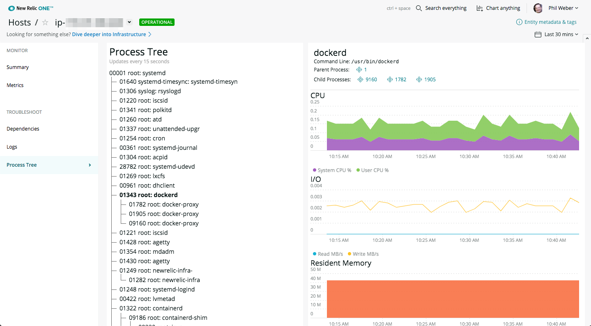

# Process Tree

## Description

Process Tree is a simple process viewer inspired by Unix’s `pstree` command.

Process Tree allows you to easily see the processes running on a host, and to inspect the CPU, I/O and memory used by a selected process.

## Usage

Select a host to see a hierarchical list of the processes running on that host. Select a process to view the CPU, I/O and memory usage of that process.

## Screenshot



## Open Source License

This project is distributed under the [Apache 2 license](./LICENSE).

## Dependencies

Requires [`New Relic Infrastructure`](https://newrelic.com/products/infrastructure).

## Getting started

First, ensure that you have [Git](https://git-scm.com/book/en/v2/Getting-Started-Installing-Git) and [NPM](https://www.npmjs.com/get-npm) installed. If you're unsure whether you have one or both of them installed, run the following command(s) (If you have them installed these commands will return a version number, if not, the commands won't be recognized):

```bash
git --version
npm -v
```

Next, use the following commands to clone and run this repository:

```bash
nr1 nerdpack:clone -r https://github.com/philweber/nr1-process-tree.git
cd nr1-process-tree
nr1 nerdpack:serve
```

Visit [https://one.newrelic.com/?nerdpacks=local](https://one.newrelic.com/?nerdpacks=local), select a host, then select the _Process Tree_ option.

## Deploying this Nerdpack

Open a command prompt in the nerdpack's directory and run the following commands.

```bash
# To create a new uuid for the nerdpack so that you can deploy it to your account:
# nr1 nerdpack:uuid -g [--profile=your_profile_name]

# To see a list of APIkeys / profiles available in your development environment:
# nr1 credentials:list

nr1 nerdpack:publish [--profile=your_profile_name]
nr1 nerdpack:deploy [-c [DEV|BETA|STABLE]] [--profile=your_profile_name]
nr1 nerdpack:subscribe [-c [DEV|BETA|STABLE]] [--profile=your_profile_name]
```

Visit [https://one.newrelic.com](https://one.newrelic.com), select a host, then select the _Process Tree_ option.

## Issues / Enhancement Requests

Issues and enhancement requests can be submitted in the [Issues tab of this repository](../../issues). Please search for and review the existing open issues before submitting a new issue.